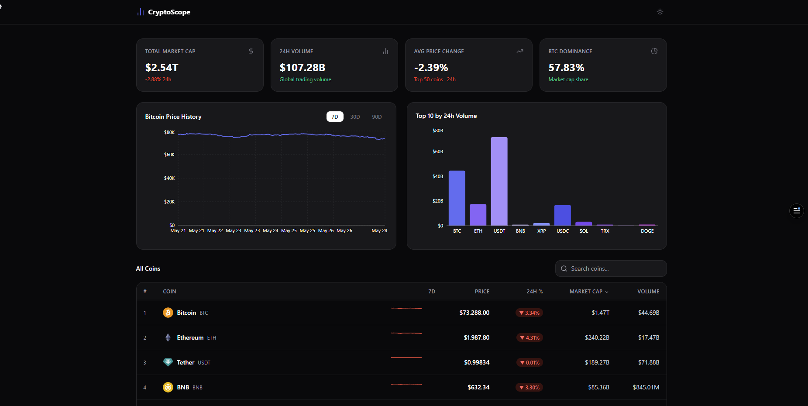

# CryptoScope — Dashboard de Analytics

Um dashboard de analytics de criptomoedas com qualidade de produção, consumindo a API pública do CoinGecko. Construído para demonstrar consumo real de API, gerenciamento de estado complexo e arquitetura limpa de componentes.

> **Demo ao vivo:** [https://cryptoscope-tau.vercel.app](https://cryptoscope-tau.vercel.app)


---

## Stack

| Responsabilidade | Biblioteca |
|---|---|
| Framework | React 18 + TypeScript (strict) |
| Estilização | TailwindCSS v4 |
| Gráficos | Recharts |
| Estado global | Zustand + persist middleware |
| Busca de dados | TanStack Query v5 |
| Roteamento | React Router v6 |
| Ícones | Lucide React |
| API | CoinGecko Public API |

---

## Funcionalidades

- **4 cards de KPI** — Market Cap, Volume 24h, Variação Média de Preço, Dominância do BTC
- **Gráfico de linha** — Histórico de preço do Bitcoin com seletor de período 7D / 30D / 90D
- **Gráfico de barras** — Top 10 moedas por volume de negociação em 24h
- **Tabela ordenável** — Ordenação por preço, variação %, market cap e volume
- **Busca com debounce** — Filtro com 300ms de debounce por nome/símbolo da moeda
- **Sparklines** — Mini gráfico de tendência dos últimos 7 dias por linha da tabela
- **Página de detalhe** — Clique em qualquer linha → `/coin/:id` com gráfico completo
- **Modo escuro / claro** — Toggle persistido no `localStorage`
- **Skeletons de carregamento** — Todo conteúdo assíncrono usa placeholders de skeleton
- **Error boundary** — Fallback amigável com ação de tentar novamente
- **Totalmente responsivo** — Layouts para mobile, tablet e desktop

---

## Como Rodar Localmente

```bash
git clone <url-do-repo>
cd analytics-dashboard
npm install
npm run dev
```

Acesse [http://localhost:5173](http://localhost:5173).

> A camada gratuita do CoinGecko permite ~30 req/min. O React Query armazena em cache as respostas por 60s para ficar bem dentro do limite.

---

## Estrutura do Projeto

```
src/
├── components/       # UI reutilizável: Card, Skeleton, ChangeBadge, ErrorBoundary, Navbar
├── features/
│   ├── dashboard/    # KpiCards, PriceChart, VolumeChart
│   └── coins/        # CoinTable, SearchInput, Sparkline
├── hooks/            # useCoinList, useCoinHistory, useGlobal, useDebounce
├── pages/            # DashboardPage, CoinDetailPage
├── services/         # coinGecko.ts — todas as chamadas fetch, totalmente tipadas
├── stores/           # uiStore (Zustand) — tema, período, ordenação, busca
├── types/            # Interfaces TypeScript compartilhadas
└── utils/            # formatters.ts — moeda, percentual, números grandes
```

---

## Decisões Arquiteturais

**Zustand em vez de Context API** — O Context re-renderiza toda a subárvore a cada mudança de estado. O Zustand usa um modelo de assinatura, então apenas os componentes que consomem uma fatia específica re-renderizam. Para um dashboard com atualizações frequentes de dados, isso faz diferença.

**React Query para estado do servidor** — Estado do servidor (dados da API) e estado do cliente (preferências de UI) têm ciclos de vida diferentes. O React Query cuida de cache, refetch em background, stale-while-revalidate e deduplicação automaticamente. `staleTime: 60s` evita sobrecarregar a API gratuita.

**Services separados dos hooks** — `services/coinGecko.ts` contém funções de fetch puras, sem dependência do React. Os hooks em `hooks/` compõem essas funções com o React Query. Isso torna a lógica de fetch testável de forma independente e reutilizável fora do React.

**Skeletons em vez de spinners** — Skeletons preservam o layout durante o carregamento, evitando Cumulative Layout Shift (CLS) e dando ao usuário uma noção da estrutura do conteúdo antes de ele chegar.

**Nenhum componente busca dados diretamente** — Todos os dados fluem por hooks customizados. Componentes recebem dados via props. Isso mantém os componentes puros, previsíveis e fáceis de testar isoladamente.

**Formatadores em utils** — A lógica de formatação (moeda, percentual, números grandes) vive em `utils/formatters.ts`. Formatação inline no JSX é difícil de testar e gera inconsistência na UI.

**Hook de debounce** — `useDebounce` atrasa a query de busca em 300ms, evitando recalcular o filtro a cada tecla pressionada. A filtragem real acontece em um `useMemo` dentro do `CoinTable`, então só recomputa quando o valor com debounce ou o estado de ordenação muda.
